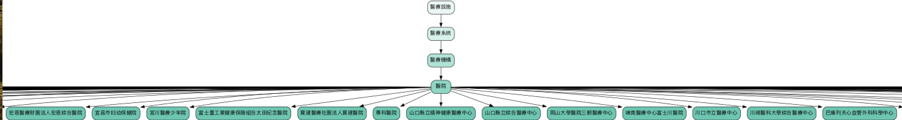

# 醫美產業主體元素樹建立實驗記錄 (2025.1.19)

## 目標
使用非大語言模型的方式,建立醫美相關概念的主體元素樹,以便更好地理解和組織醫美領域的概念結構。

進一步視覺化python visualize_tree.py

## 實作方法

1. 使用 Wikidata知識庫作為上下級概念來源
2. 建立 WikidataClient 類別處理查詢邏輯
3. 實作概念樹結構 (ConceptNode)
4. 加入快取機制提升效能
5. 過濾非中文和非相關領域的結果

## 主要功能

1. 利用Wikidata知識庫本身的查詢層級關係 (query_hierarchy)
   - 支援上位概念 (broader) 和下位概念 (narrower) 查詢
   - 使用 SPARQL 查詢 Wikidata
   - 包含多種語意關係:
     - 子類別subclass of (P279)
     - 實例instance of (P31)
     - 部分part of (P361)
     - 特徵facet of (P1269)
     - 使用uses (P2283)
     - 被使用used by (P1535)
     - 產業industry (P452)

2. 概念樹建立 (build_concept_tree)
   - 從最一般的概念開始建立樹狀結構
   - 保持層級關係的正確性
   - 支援多層級的概念組織

3. 同義詞處理 (find_related_terms)
   - 維護醫美領域常見同義詞對應
   - 擴展查詢範圍提高查詢成功率

4. 領域相關性判斷 (is_business_related)
   - 定義關鍵詞集合
   - 過濾非相關領域的概念

## 優化措施

1. 快取機制
   - 使用 CacheManager(記憶體快取管理)儲存對語料中概念的查詢結果
   - 減少重複查詢的開銷
   - 快取清理工具：
      - 自動清理空查詢結果的快取檔案

2. 語言處理
   - 優先使用繁體中文結果
   - 因Wikidata包含非中文內容,過濾非中文內容

## 目前挑戰

1. 資料完整性
   - 部分醫美相關概念在 Wikidata 中缺乏完整的層級關係
   - 某些專業術語可能找不到對應條目

2. 同義詞對應
   - 需要更完整的醫美領域專業術語對照表
   - 處理不同用語習慣的差異

## 下一步計劃

1. 資料擴充
   - 擴充同義詞表
   - 添加更多醫美專業術語
   - 補充缺失的層級關係

## 執行方式

1. 主程式執行 (main.py)
   - 執行命令: `python main.py`
   - 功能流程:
     1. NER處理: 使用NERProcessor提取實體
     2. 實體過濾: 使用EntityFilter過濾醫療/醫美相關實體
     3. 概念樹生成: 使用ConceptTreeManager建立概念層級
     4. 輸出結果: 顯示分類後實體與儲存概念樹

2. 視覺化工具 (visualize_tree.py)
   - 執行命令: `python visualize_tree.py`
   - 功能:
     - 讀取concept_trees.json
     - 為每個概念樹生成視覺化圖形
     - 輸出PNG格式的層級關係圖
     - 使用不同顏色深淺表示層級深度

3. 檔案結構
   - data/
     - ner/: 儲存NER處理結果
     - trees/: 儲存生成的概念樹
     - cache/: 儲存Wikidata查詢快取
   - visualization/: 儲存視覺化輸出圖形

4. 輸出檔案
   - ner_results.json: NER(主體元素)識別結果
   - concept_trees.json: 概念樹結構
   - visualization/*.png: 視覺化圖形
